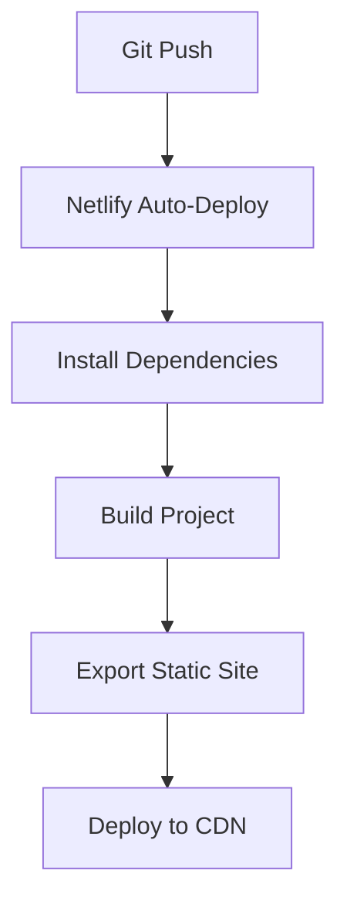

# Chiuri Butter - Netlify Deployment Guide

## Prerequisites
- GitHub account
- Netlify account
- Node.js v18+ installed locally

## 1. GitHub Setup
```bash
git init
git add .
git commit -m "Initial commit"
gh repo create chiuri-butter --public --push --source=.
```

## 2. Netlify Configuration
1. Go to [Netlify](https://app.netlify.com/) and click "New site from Git"
2. Select GitHub as your Git provider
3. Choose the chiuri-butter repository
4. Configure build settings:
   - Base directory: (leave empty)
   - Build command: `npm run build`
   - Publish directory: `out`
5. Click "Deploy site"

## Deployment Workflow


## Environment Variables
Netlify automatically provides:
- `$URL` - The production URL of your site
- `$DEPLOY_URL` - The URL of the current deploy

## Custom Domain (Optional)
1. Go to "Domain settings" in Netlify
2. Click "Add custom domain"
3. Follow DNS configuration instructions

## Troubleshooting
- **Build fails**: Check Netlify logs for errors
- **Missing assets**: Verify `out` directory contains all files
- **Environment issues**: Ensure Node.js version matches (v18.17.1)