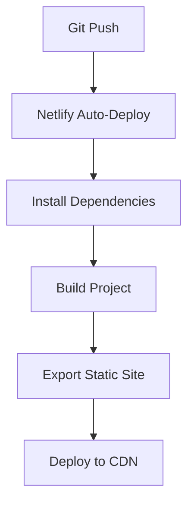

# Chiuri Butter - Netlify Deployment Guide

## Prerequisites
- GitHub account
- Netlify account
- Node.js v18+ installed locally

## Local Development (Static Export)
1. Install dependencies:
```bash
npm install
```

2. Build the static site:
```bash
npm run build
```

3. Serve the exported site:
```bash
npm start
```

4. Access at: http://localhost:3000

### Troubleshooting
- If you see blank pages, ensure:
  - You ran both `build` and `export`
  - No dynamic server-side features are used
  - All routes have corresponding HTML files in `out`

## 1. GitHub Setup
```bash
git init
git add .
git commit -m "Initial commit"
gh repo create chiuri-butter --public --push --source=.
```

## 2. GitHub Pages Deployment
1. Ensure workflow file exists in `.github/workflows/gh-pages.yml`
2. Push changes to main branch:
```bash
git push origin main
```
3. GitHub Actions will automatically:
   - Build the static site
   - Deploy to gh-pages branch
4. Enable GitHub Pages:
   - Go to Repository Settings > Pages
   - Select "Deploy from branch"
   - Choose "gh-pages" branch
   - Click "Save"

## 3. Netlify Configuration
1. Go to [Netlify](https://app.netlify.com/) and click "New site from Git"
2. Select GitHub as your Git provider
3. Choose the chiuri-butter repository
4. Configure build settings:
   - Base directory: (leave empty)
   - Build command: `npm run build`
   - Publish directory: `out`
5. Click "Deploy site"

## Deployment Workflow


## Environment Variables
Netlify automatically provides:
- `$URL` - The production URL of your site
- `$DEPLOY_URL` - The URL of the current deploy

## Custom Domain (Optional)
1. Go to "Domain settings" in Netlify
2. Click "Add custom domain"
3. Follow DNS configuration instructions

## Troubleshooting
- **Build fails**: Check Netlify logs for errors
- **Missing assets**: Verify `out` directory contains all files
- **Environment issues**: Ensure Node.js version matches (v18.17.1)